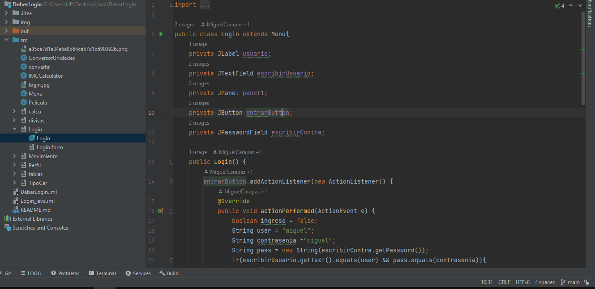

# DeberLogin
Se creo un login en el que si se ingresa mal las credenciales no deja acceder al sistema
cuando ingresamos al sistema se puede observar una imagen de perfil del usuario
y un menu contenedor de los componentes de con diferentes funcionalidades como por ejemplo:
#
FUNCIONALIDADES CON COMPONENTES
#
1.menu(JMenuBar)
#
2.calculadora de divisas (JComboBox,JTextField)
#
3.IMC (JSpinner) 
#
4.Calculadora (JColorChooser) 
#
5.Convertidor de unidades (JList) 
#
6.Stock de una tienda (JScrollPane)
#
7.Tipo de carro (JRadioButton)
#
8.Perfil se despliegue la foto grande y se la pueda mover usando (JScrollPane)
#
9.Superponer imagenes de peliculas opciones que hagan apareser imagenes, (JLayeredPane)
#
10.Imagen a la opcion que uno quiera que pueda moverla dentro del form (JInternalFrame)

			    LINK DEL VIDEO
https://youtu.be/B5bUKw1Ed5M
			    
			    CAPTURAS DE PANTALLA

